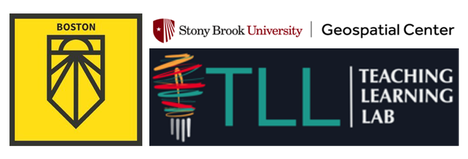
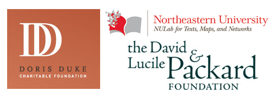

<!--This is the main content file to edit for this page. It is embedded in src/pages/about.js. The page title comes from the .json in this same folder.-->

**Environmental Enforcement Watch (EEW)** is a collaborative project across [Environmental Data and Governance Initiative](http://www.envirodatagov.org/) (EDGI) working groups. The EEW project builds on EDGI’s 2019 Sheep in the Closet report that documents large declines in EPA enforcement of environmental laws. It is also inspired by the [Open Water Data project](http://datalanterns.com/), which visualized Clean Water Act violations with floating lanterns in a community art event developed by EDGI co-founder Sara Wylie, Laura Perovich, and the environmental justice organization GreenRoots. Both projects used data from EPA’s [Enforcement and Compliance History Online](https://echo.epa.gov/) (ECHO) database. They revealed how useful ECHO could be for communities to track pollution and EPA responses in their areas. However, they also revealed the inaccessibility of ECHO for non-specialists, along with many omissions, errors, and confusions present in the data itself. The EEW workshops aim to make ECHO data more readily accessible and meaningful for impacted communities while highlighting how ECHO data can be improved.

EEW WEB ICON

<big>Together, we can use publicly available data to hold our government and industry accountable.</big>

## Our Goals

* Draw large-scale public attention to lack of environmental enforcement.
* Work with partner organizations, especially marginalized communities, to build data efficacy through mutually beneficial relationships.
* Inform EPA visions of alternative forms of public engagement—a Green New Deal for environmental data.
* Prototype community-oriented structures for environmental data, i.e. by health factors for a community.
* Bring attention to the relationship between environmental enforcement, environmental racism, and other interlocking forms of oppression (particularly white supremacy, capitalism, settler-colonialism, heteropatriarchy, etc.)

## The Environmental Data and Governance Initiative

EDGI is an international network of over 175 members from more than 80 different academic institutions and non-profits, comprised foremost by grassroots volunteer efforts. Since 2016, EDGI has served as a preeminent watchdog group for federal environmental data, generating international effort to duplicate and monitor repositories of public data that are vital to environmental health research and knowledge.

EDGI’s work has been widely acknowledged, leading to EDGI testifying before Congress on declines in EPA enforcement, and hundreds of mentions in leading national and international media such as The New York Times, The Washington Post, Vice News, and CNN. For more about our work, read our [2019 Annual Report](https://envirodatagov.org/publication/edgi-annual-report-2019/) and [2020 Annual Report](https://envirodatagov.org/publication/edgi-annual-report-2020/).

## Environmental Data Justice
A lot of the work in EEW stems from EDGI’s work around “Environmental Data Justice,” or EDJ. EDJ promotes the production and use of environmental data to challenge structures of oppression like fascism, racism, heteropatriarchy, and classism. We believe that data should serve communities and not just corporate polluters. We also believe that communities should be able to have more resources for collecting and analyzing environmental data while retaining the power to decide what they can do with it. You can read more about EDJ and find some related readings in the [EDJ Syllabus here](https://docs.google.com/document/d/1O7ytnzXWFkluiYE4Pulo_mCHs9jdNpPm8hw83aLU2pg/edit?usp=sharing).

## Participants

NAMES ETC

## Collaborators

## Funding

