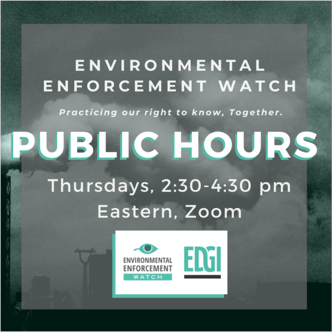

<!--This is the main content file to edit for this page. It is embedded in src/pages/events.js, which adds additional content. The page title comes from the .json in this same folder.-->

## Join us for upcoming public workshops!

**August 20th –** Learn about national trends in environmental enforcement & compliance. Work on creative visualizations & share stories to contextualize findings.

**August 27th –** Analyze environmental data in congressional districts of legislators that oversee the EPA. Begin building a repository of what will be 76 *EEW Congressional Report Cards*.

**September 3rd –** Build on the work of the previous week.

**September 10th –** Build on the work of the previous week & discuss ways to move the work forward.

<big>[Sign up for a workshop here](https://docs.google.com/forms/d/e/1FAIpQLSecS_MMcDyMlF_BMECQeOvCGPBtAa5lGIM5chDL_7iXfPH-NA/viewform)</big>

<!-- `video: [About Environmental Enforcement Watch](https://youtube.com/embed/k-OjWt5lBRQ)` -->
