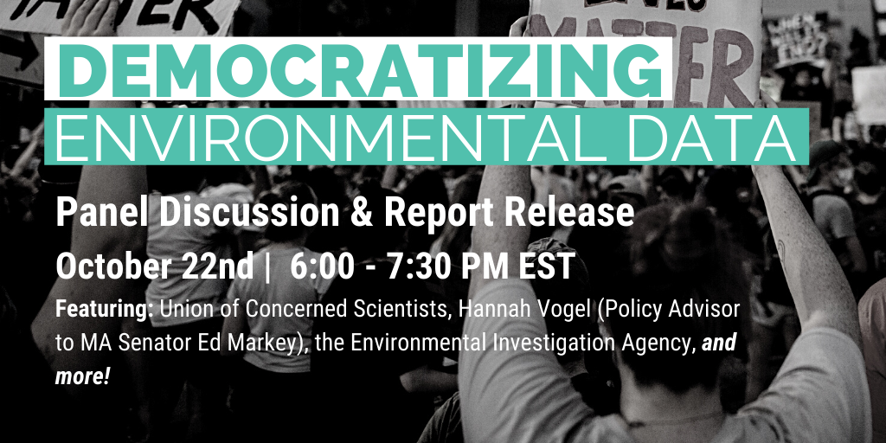

<!--This snippet goes above the main content in `events-content.md` in this folder-->

<big>Want to attend? Register <a href=https://us02web.zoom.us/webinar/register/WN_dAn8xJF9Tqm1aiC1A8Ysig >here</a></big>

 

EDGI's EEW events engage members of the public in the process of report-making, from delving into the data science and running Jupyter Notebooks to sharing stories about their home areas. Over the summer, we co-hosted workshops with the [Sunrise Movement Boston Hub](http://www.facebook.com/SunriseBoston/), as well as a four-part public workshop series dedicated to the completion of [EEW Congressional Report Cards](https://edgi-govdata-archiving.github.io/EEW-Website/reports) for two key committees. In commitment to the principles of EDJ, all of our code and data are available on EDGI’s GitHub [https://github.com/edgi-govdata-archiving] site, an open-source coding platform. 

## Recordings of past events:
* [Sunrise workshop date (7/18/2020)](https://www.youtube.com/watch?v=rCs35rmDo9c&list=PLtsP3g9LafVv78TIa42xr591-4CfKMYQO&index=49&t=1678s)
* [EEW Public Hours workshop 1 (8/20/2020)](https://www.youtube.com/watch?v=Gp1aDeXMays&list=PLtsP3g9LafVv78TIa42xr591-4CfKMYQO&index=31)
* [EEW Public Hours workshop 4 (9/10/2020)](https://www.youtube.com/watch?v=dUV3NweSWTs&list=PLtsP3g9LafVv78TIa42xr591-4CfKMYQO&index=21&t=212s)

# You can EEW, too.
Importantly, these workshops are not meant to center EDGI or the EEW team. Rather, we hope that every workshop will be co-hosted by one or more partner organizations: community groups, national environmental watchdogs, research hubs, and everything in between. We are here to help you answer pressing questions and create materials and networks that support your advocacy and organizing efforts.

EEW workshops begin with collective report-making through the Jupyter Notebooks, followed by breakout sessions into different tracks based on participants’ own skills and interests. The outcomes of the various tracks will then be compiled into a single report that is informative, visually interesting, and oriented toward community action. Building on the Congressional Report Cards project, we aim to compile EEW reports into an interactive map or repository to demonstrate the power of collective action and data stewardship in addressing unchecked environmental violence. Additionally, we encourage—and can help facilitate—partners and participants to develop other creative outcomes and demonstrations from these workshops.

<!--This page has a javascript element in src/pages/events.js, then content continues in events-content.md in this same folder-->
