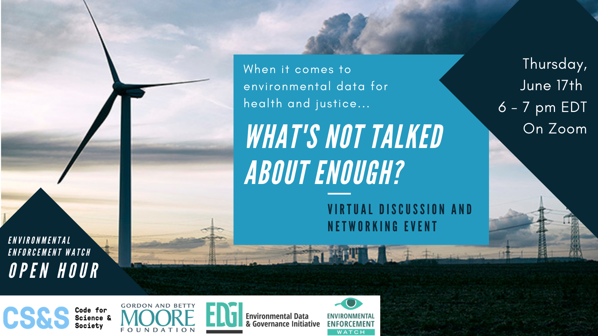
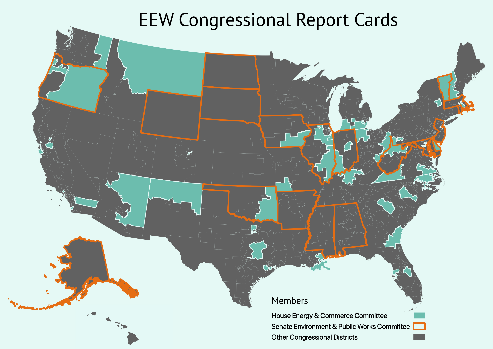

<!--This is the main content file to edit for this page. It is embedded in src/pages/index.js, which adds additional content-->

# Strong environmental regulation is important, but it’s only as good as its enforcement.

The Environmental Protection Agency (EPA) is charged by Congress to enforce laws that protect people from air pollution, water pollution, and hazardous waste. The Environmental Enforcement Watch (EEW) works [with members of the public](/events) to analyze and present EPA data on violations of environmental laws, inspections of polluting facilities, and enforcement actions by the EPA.

<a href="https://www.eventbrite.com/e/eew-open-hour-whats-not-talked-about-enough-tickets-155823794163">RSVP</a>

 

<a href="https://docs.google.com/document/d/1DxvgF_UmMZsqFSnN8-3_gmDgForcG55zy1o6XwI7VeY/edit?usp=sharing">UX Designer</a> | <a href="https://docs.google.com/document/d/150itkIXSltc_m2yAaXKwUf-whZjLo4Q9o-fduHDf-Cg/edit?usp=sharing">Web Developer</a>

  
 

## Join us at an upcoming event!

<iframe src="https://calendar.google.com/calendar/embed?height=600&amp;wkst=1&amp;bgcolor=%23defaf6&amp;ctz=America%2FNew_York&amp;src=c280bXJsNjk5YWVhNTE5bnQxNzhwNTBwMzhAZ3JvdXAuY2FsZW5kYXIuZ29vZ2xlLmNvbQ&amp;color=%23defaf6&amp;mode=AGENDA&amp;showTabs=0&amp;showPrint=0&amp;showDate=0&amp;showNav=0&amp;showCalendars=0&amp;showTz=1&amp;showTitle=0" style="border-width:0" width="700" height="250" frameborder="0" scrolling="no"></iframe>

  

The map below shows the states and districts with completed report cards:

<a href="/reports"><big>Show me the reports</big></a>

 

<!--handy encoder if you want to change the tweet text: https://meyerweb.com/eric/tools/dencoder/ -->

<a href="https://twitter.com/intent/tweet?text=EPA%20is%20overseen%20by%20two%20congressional%20committees.%20%40EnviroDGI%20took%20a%20look%20at%20environmental%20enforcement%20in%20committee%20members%27%20home%20districts%3A%20environmentalenforcementwatch.org%20%23EEWatch" target=_blank rel=noopener >Share this page</a>

 

# Practicing our right to know, together.

We want clean air, clean water, and an end to environmental racism and injustice. 

We believe in the public’s right to know, and that we can collaboratively design public open-source systems to analyze, discuss, and act on environmental data collectively. EPA data is available to the public through the <a href="https://echo.epa.gov/" target=_blank rel=noopener >Enforcement and Compliance History Online</a> (ECHO) database. ECHO data includes reported violations of environmental laws such as the Clean Air Act (CAA), Clean Water Act (CWA), and the Resource Conservation and Recovery Act (RCRA), which manages hazardous waste, as well as data on emissions, facility inspections, and enforcement actions issued by the EPA and state agencies. However, the database can be challenging to use and error-prone. EEW works to make this data more accessible, user-friendly, and collectively actionable through <a href="/events">public workshops</a>, <a href="https://github.com/edgi-govdata-archiving" target=_blank rel=noopener >open-source data tools</a>, and projects like the <a href="/reports">Congressional District Report Cards</a> and <a href="https://envirodatagov.org/more-permission-to-pollute-the-decline-of-epa-enforcement-and-industry-compliance-during-covid/" target=_blank rel=noopener >COVID-19 enforcement report</a>.
