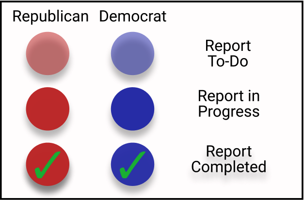

<!--This is the main content file to edit for this page. It is embedded in src/pages/cd-reports.js-->

## About EEW Report Cards
Help EDGI create Environmental Enforcement Watch (EEW) report cards for each member of the House and Senate Committees responsible for oversight of the Environmental Protection Agency (EPA).

The [Senate Environment and Public Works Committee](https://www.epw.senate.gov/public/) and the [House Energy and Commerce Committee](https://energycommerce.house.gov/) have jurisdiction over the EPA. The EPA is mandated to enforce environmental laws such as the:

* Clean Water Act (CWA)
* Clean Air Act (CAA)
* Resource Conservation and Recovery Act (RCRA)

EEW Report Cards analyze and present data on violations of environmental laws, inspections of polluting facilities, and enforcement actions by the EPA for the congressional districts of each Representative on the House Energy and Commerce Committee, as well as the State of each Senator on the Environment and Public Works Committee. Our goal is to shed light on the chronic and routine violations of environmental laws and the failure to enforce environmental laws. <b>To participate, sign up [here](https://docs.google.com/forms/d/e/1FAIpQLSecS_MMcDyMlF_BMECQeOvCGPBtAa5lGIM5chDL_7iXfPH-NA/viewform?usp=sf_link) or at the bottom of this page!</b>

##How are we making the EEW Report Cards?

These report cards will be compiled through public online workshops where we gather and analyze data from the EPA’s [Enforcement and Compliance History Online (ECHO)](https://echo.epa.gov/) for each State or Congressional District.

At these events, participants will analyze, contextualize, and relate their personal stories to ECHO data, hopefully building connections along the way. EEW will format the data for each district and state into a public report card for release in October of 2020, and compile an online repository of these report cards for each of the 76 Congresspeople who sit on the House Energy & Commerce Committee and the Senate Environment and Public Works Committee. 

Participants can sign up for one of the assigned report cards below, or they can make one for their congressional district. Our events are 2 hours long, on Thursdays from 2:30-4:30 EST, and no coding skill or background in environmental law required!

## Senate Environment & Public Works Committee:

Key:

## House Energy & Commerce Committee:

Key:

<big>Want to participate? Sign up here:</big>

<iframe src="https://docs.google.com/forms/d/e/1FAIpQLSecS_MMcDyMlF_BMECQeOvCGPBtAa5lGIM5chDL_7iXfPH-NA/viewform" width = 100% height=1600px/>
