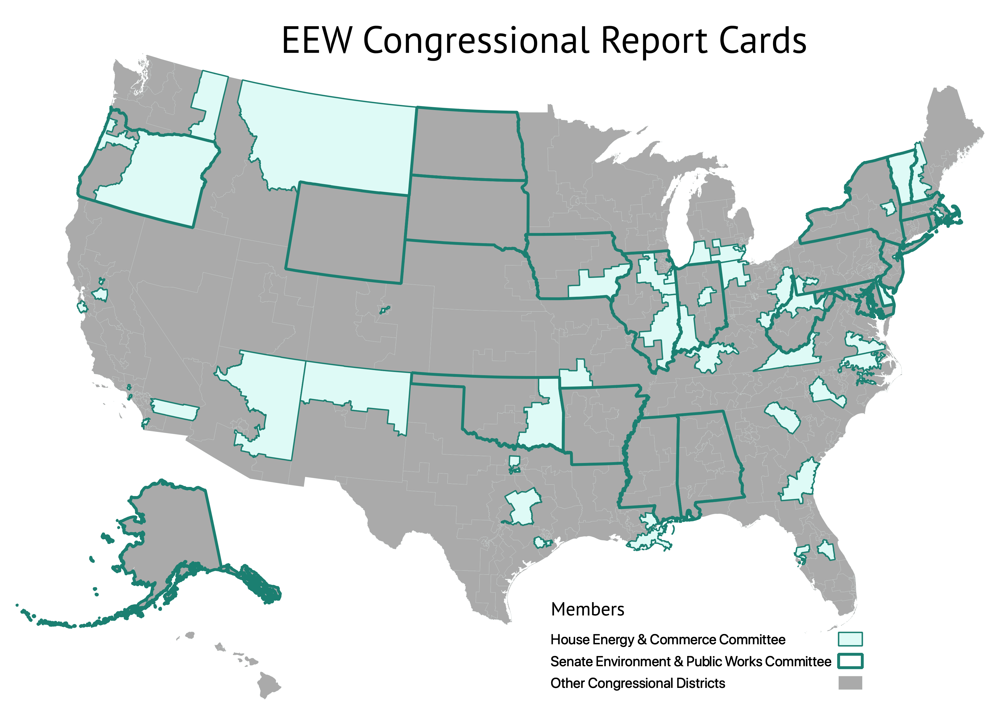

<!--This snippet goes above the main content in `reports-content.md` in this folder-->

<form>
<input type="button" value="Ver la versión en español" onclick="window.location.href='../reports-es'" />
</form>

Two key congressional committees oversee the EPA to ensure it meets its mandate: the <a href="https://energycommerce.house.gov/" target=_blank rel=noopener >House Energy and Commerce Committee</a> and the <a href="https://www.epw.senate.gov/public/" target=_blank rel=noopener >Senate Environment and Public Works Committee</a>.

EEW Congressional Report Cards analyze and present data on violations of environmental laws, inspections of polluting facilities, and enforcement actions by the EPA, to give the members of these Congressional committees–and their constituents–the chance to evaluate whether the EPA is fulfilling its mandate in their state/district.

The map below shows the states and districts with completed report cards:

To view our summary report of all districts and states analyzed, see:

<big>Summary Report – <a href="https://envirodatagov.org/wp-content/uploads/2020/10/Democratizing-Data-Summary-Report.pdf">Democratizing Data: Environmental Enforcement Watch's Report Cards for Congressional Oversight of the EPA</a></big>

## Individual report cards

Below, **hover** to see the name and rank of a representative; **click** to open a full report on EPA enforcement in the representative's district or state:
